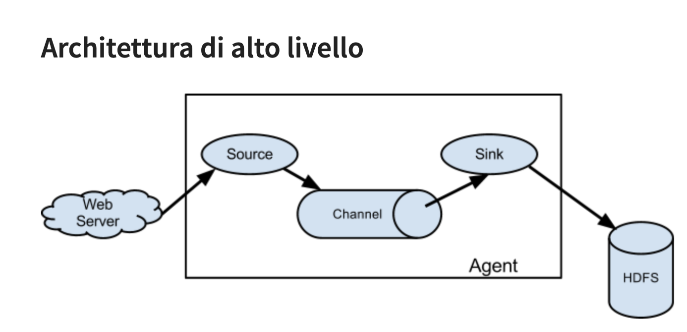
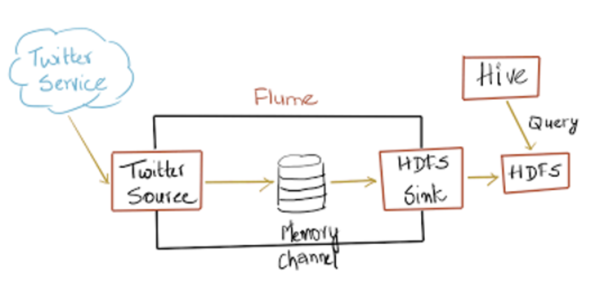
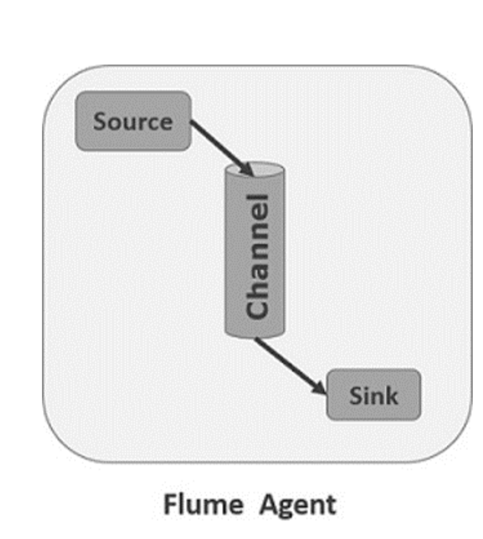
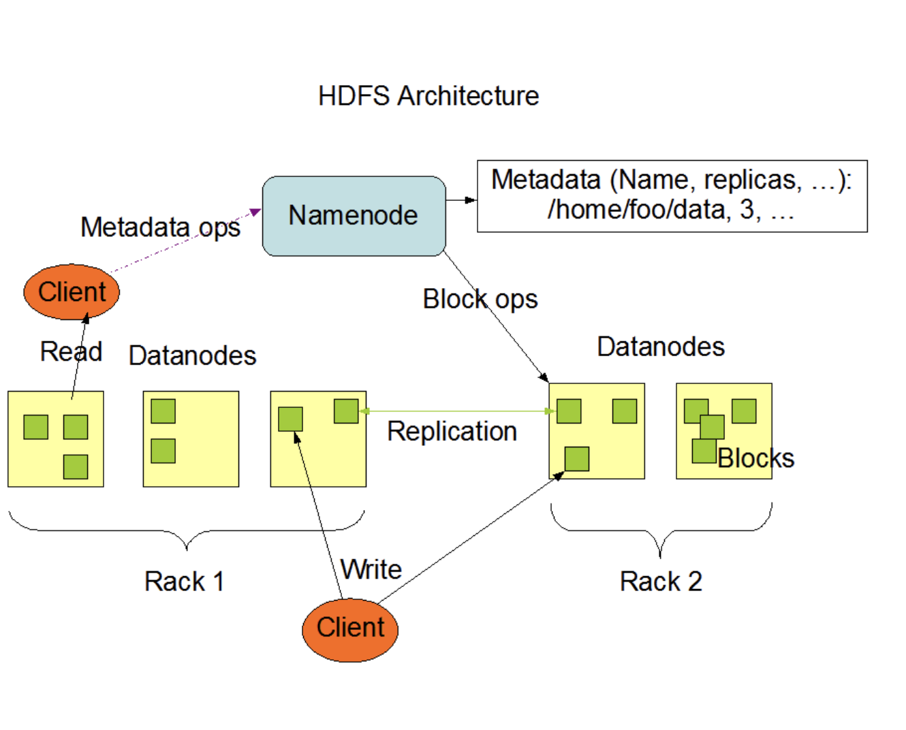

# Apache Flume

**Apache Flume** è un sistema **distribuito, affidabile e altamente disponibile** progettato per la **raccolta, l’aggregazione e il trasferimento efficiente di grandi volumi di dati** provenienti da molteplici fonti verso un archivio dati centralizzato, come ad esempio **Hadoop HDFS** o altri sistemi di storage.

Dal punto di vista architetturale, Flume è **distribuito**, poiché consente di utilizzare più agenti che operano in parallelo per gestire simultaneamente diverse sorgenti e destinazioni (sink).
È inoltre **affidabile**, grazie all’uso di un approccio **transazionale** che garantisce la corretta consegna degli eventi: ogni evento, infatti, viene temporaneamente conservato in un **canale** (channel) e trasferito al sink solo dopo il completamento dell’operazione di scrittura, assicurando così la **tolleranza ai guasti** e l’assenza di perdite di dati.

Essendo un progetto **open source** e maturo, Flume offre una **disponibilità elevata** e un’elevata **scalabilità**, risultando adatto a contesti di Big Data e analisi in tempo reale.
Per ottenere un’efficienza ottimale, il sistema si basa su tre operazioni fondamentali:

* **Collezionare**: acquisire i dati da diverse sorgenti, rendendoli immediatamente disponibili per l’elaborazione;
* **Aggregare**: unire e normalizzare i flussi provenienti da fonti eterogenee, semplificando la gestione e l’analisi;
* **Trasferire (trasloco)**: convogliare i dati raccolti verso una destinazione comune, solitamente un data lake o un sistema analitico centralizzato.

## L'uso di Flume

L’utilizzo del **canale** in Apache Flume non si limita esclusivamente all’aggregazione dei dati di registro (log).
Grazie alla sua architettura modulare e alla possibilità di **personalizzare le fonti di dati (sources)**, Flume può essere impiegato in un’ampia varietà di scenari per il **trasferimento di grandi quantità di dati di evento**.

In particolare, Flume è in grado di gestire e trasportare flussi informativi provenienti da numerose tipologie di sorgenti, tra cui — a titolo esemplificativo ma non esaustivo —:

* **Dati sul traffico di rete**, utili per il monitoraggio delle prestazioni, la sicurezza o l’analisi del comportamento degli utenti;
* **Dati generati dai social media**, come post, commenti o interazioni, che possono essere raccolti per finalità di analisi del sentiment o studio delle tendenze;
* **Messaggi di posta elettronica**, che possono essere elaborati e archiviati per scopi di auditing, data mining o analisi testuale.

In generale, Apache Flume può essere configurato per acquisire **praticamente qualsiasi tipo di fonte dati**, purché essa possa essere rappresentata come un **flusso di eventi**.
Questa estrema flessibilità rende Flume uno strumento estremamente potente per l’integrazione e il trasporto dei dati all’interno di **ecosistemi Big Data**, garantendo **scalabilità**, **affidabilità** e **consistenza** del trasferimento.

## Data Event

In Apache Flume, un **evento** rappresenta l’unità fondamentale del flusso di dati.
Più precisamente, un **evento Flume** è definito come un’entità che incapsula un **payload** — ovvero un insieme di **byte** contenenti i dati effettivi da trasportare — accompagnato da un **insieme opzionale di attributi** sotto forma di coppie *chiave-valore* (stringhe).

Il **payload** costituisce la parte principale dell’evento e può contenere qualsiasi tipo di informazione, come ad esempio un messaggio di log, una riga di testo, un frammento JSON o un pacchetto binario.
Gli **attributi**, invece, forniscono **metadati** aggiuntivi che descrivono o contestualizzano il contenuto del payload, quali l’origine del dato, il timestamp di generazione, l’indirizzo IP del mittente o il tipo di evento.

## Sorgente

Una **sorgente Flume** è il componente incaricato di ricevere gli eventi provenienti da una **sorgente esterna**, come ad esempio un server web o un’applicazione.
La sorgente esterna trasmette i dati a Flume in un **formato compatibile** con quello previsto dalla sorgente Flume configurata, consentendo al sistema di acquisire correttamente gli eventi e inserirli nel flusso di elaborazione.

Le sorgenti possono operare secondo due modalità principali:

- **interrogabili**, quando è Flume a richiedere periodicamente nuovi dati alla sorgente esterna,
- **guidate da eventi**, quando è la sorgente stessa a inviare automaticamente i dati non appena vengono generati.

## Canale

Quando una **sorgente Flume** riceve un evento, questo viene memorizzato in uno o più **canali**.
Il **canale** funge da **archivio intermedio e passivo**, incaricato di conservare l’evento fino a quando non viene prelevato e consumato da un **sink Flume**.

In altre parole, il canale rappresenta il **collegamento logico** tra la sorgente e il sink, garantendo la **trasmissione affidabile e ordinata** degli eventi lungo la pipeline.
Inoltre, la configurazione del canale determina la **durata e le modalità di conservazione** degli eventi durante il trasferimento, influenzando così le prestazioni e l’affidabilità complessiva del sistema.

## Livello(Sink)

Un **sink** in Apache Flume rappresenta la **controparte della sorgente**, poiché costituisce la **destinazione finale** degli eventi all’interno della pipeline di trasferimento dati.
Dopo che gli eventi vengono acquisiti da una sorgente e temporaneamente memorizzati in un canale, il sink si occupa di **prelevarli e inviarli** verso il sistema di destinazione, completando così il flusso di elaborazione.

## Agente(Agent)

Un **agente Flume** è il processo che **integra e coordina** i principali componenti di Flume: la **sorgente (source)**, il **canale (channel)** e il **sink**.
All’interno dell’agente, questi elementi vengono **definiti, nominati e configurati** in modo da stabilire il percorso che gli eventi devono seguire dal punto di origine fino alla loro destinazione finale.

Ogni agente può gestire **uno o più canali**, ai quali sono associati la sorgente e il sink corrispondenti.
In questo modo, l’agente realizza una **pipeline di trasferimento dati autonoma**, garantendo il corretto flusso degli eventi e la loro consegna affidabile tra i vari componenti del sistema

## HDFS (Hadoop Distributed File System)
L’HDFS (Hadoop Distributed File System) rappresenta il principale sistema di archiviazione distribuito utilizzato dalle applicazioni Hadoop.
Un cluster HDFS è composto principalmente da un NameNode, responsabile della gestione dei metadati del file system, e da uno o più DataNode, incaricati di memorizzare i dati effettivi.

Il diagramma dell’architettura HDFS evidenzia le interazioni fondamentali tra NameNode, DataNode e client.
In particolare, i client si interfacciano con il NameNode per ottenere o modificare i metadati relativi ai file, mentre le operazioni di input/output sui dati vengono eseguite direttamente in comunicazione con i DataNode.

