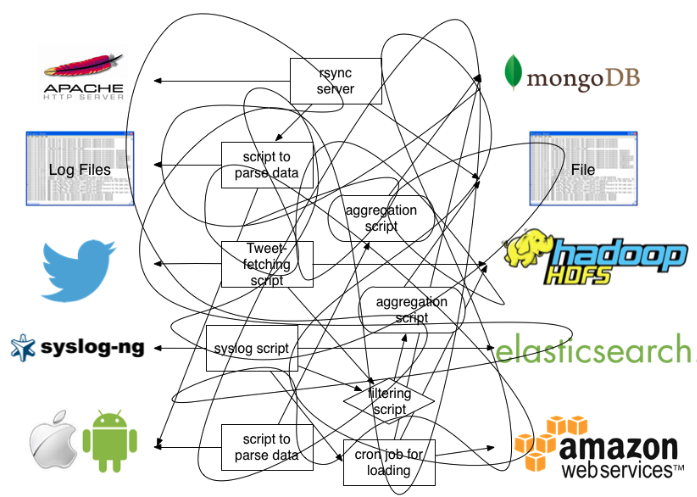
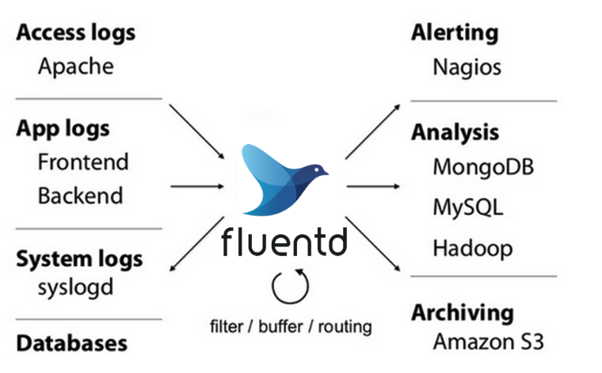
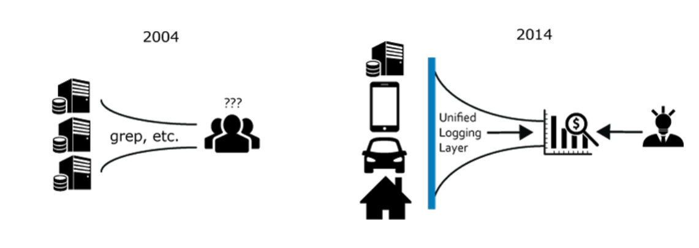
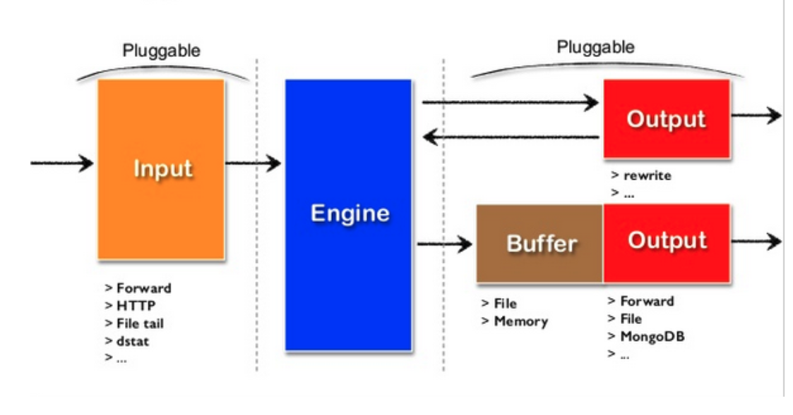
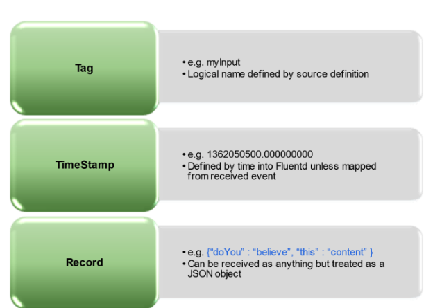

# Fluentd

## Livello di registrazione unificato

**Fluentd** è uno strumento open source per la **raccolta e l’unificazione dei log**, progettato per separare le fonti di dati dai sistemi di destinazione (backend).
Funziona come un **livello intermedio di registrazione unificato**, che raccoglie, filtra, trasforma e inoltra i dati provenienti da diverse fonti verso molteplici destinazioni.

### Prima di Fluentd

Senza un sistema di raccolta centralizzato, ogni applicazione o server invia i propri log direttamente a servizi di analisi o archiviazione, con conseguente complessità di integrazione, ridondanza e difficoltà di gestione.



### Dopo Fluentd

Con Fluentd, le fonti di dati vengono collegate a un unico agente di raccolta, che si occupa di normalizzare i log e inoltrarli ai backend desiderati.
In questo modo si ottiene un flusso di dati coerente e facilmente gestibile.



---

## Architettura semplice ma flessibile

Fluentd si distingue per la sua architettura **modulare e altamente estendibile**, che gli consente di adattarsi a un’ampia varietà di contesti.
Il sistema si basa su oltre **500 plugin**, che permettono di collegarlo a numerose fonti di input (come file di log, API o code di messaggi) e a diversi output (come database, sistemi di monitoraggio o servizi cloud).

I plugin sono **sviluppati in Ruby** e distribuiti attraverso il repository **RubyGems**, garantendo un’elevata facilità di installazione e aggiornamento.

Grazie a questa flessibilità, Fluentd è utilizzato da più di **5.000 aziende** orientate ai dati.
Uno dei suoi principali utenti gestisce la raccolta di log provenienti da **oltre 50.000 server**, dimostrando la robustezza e la scalabilità della piattaforma.

---

## Casi d’uso principali

Fluentd viene impiegato in una vasta gamma di scenari legati all’analisi e al monitoraggio dei dati.Tra i casi d’uso più comuni troviamo:

- **Raccolta centralizzata dei log** provenienti da più server o container.
- **Integrazione con stack di osservabilità** come Elasticsearch, Grafana, Prometheus o Splunk.
- **Pre-elaborazione dei dati** (filtraggio, formattazione, anonimizzazione) prima dell’invio ai sistemi di storage o analisi.
- **Ingestione di dati in pipeline di Big Data** come Apache Kafka, Hadoop o Spark.

---

## Origini e sviluppatori

Fluentd è stato sviluppato da **Treasure Data, Inc.**, una società specializzata in soluzioni di gestione dei dati nel cloud.
L’obiettivo principale era creare un sistema in grado di **semplificare la raccolta e la gestione dei log** in contesti di Big Data, garantendo un’integrazione agile con i più diffusi sistemi di elaborazione e archiviazione.

Treasure Data offre inoltre un proprio **Cloud Data Service**, che consente agli utenti di Fluentd di archiviare e analizzare facilmente i dati raccolti, senza la necessità di mantenere un’infrastruttura backend dedicata.

---

## I dati di registro sono per le macchine

Fluentd tratta i dati di registro come **dati strutturati**, piuttosto che come semplici stringhe di testo.
Ciò consente di eseguire operazioni più sofisticate sui log, come il filtraggio basato su campi specifici, la trasformazione dei dati in formati diversi e l’inoltro selettivo a destinazioni multiple in base al contenuto dei log stessi.

Questo approccio migliora notevolmente l’efficienza e la flessibilità nella gestione dei log, facilitando l’analisi e l’integrazione con altri sistemi di dati.



---

## Intenti di Fluentd

### Architettura basata su plugin

Fluentd è progettato con un’architettura modulare basata su plugin,
che consente agli utenti di estendere facilmente le sue funzionalità aggiungendo nuovi **input**, **output** e **filtri**.
Questa modularità rende Fluentd altamente adattabile a diverse esigenze di raccolta e gestione dei log.



---

### Vita di un evento di Fluentd

Un evento in Fluentd attraversa diverse fasi, dalla raccolta alla trasformazione fino all’inoltro:

1. **Input** – I dati di log vengono raccolti da varie fonti.
2. **Buffering** – Gli eventi vengono memorizzati temporaneamente in buffer per garantire affidabilità e gestione del carico.
3. **Filtering** – I dati possono essere filtrati o trasformati in base a regole definite.
4. **Output** – Gli eventi vengono inoltrati alle destinazioni finali, come database, sistemi di monitoraggio o servizi cloud.

---

### Struttura di un evento

Un evento in Fluentd è rappresentato come una struttura dati composta da:

- **Tag** – Una stringa che identifica la categoria o la fonte dell’evento.
- **Timestamp** – Un marcatore temporale che indica quando l’evento è stato generato (in nanosecondi).
- **Record** – Un insieme di coppie chiave-valore che rappresentano i dati effettivi dell’evento in formato **JSON**.



---

## File di configurazione

Il file di configurazione è l'elemento fondamentale per collegare tutti i componenti, poiché consente di definire quali **input** o listener Fluentd avrà e di impostare regole di corrispondenza per instradare i dati degli eventi verso un **output** specifico.

```editorconfig
<source>
  @type http
  port 8888
  bind 0.0.0.0
</source>

<filter test.cycle>
  @type grep
  <exclude>
    key action
    pattern ^logout$
  </exclude>
</filter>

<match test.cycle>
  @type stdout
</match>
```

In questo esempio di configurazione:

- La sezione `<source>` definisce un input di tipo HTTP che ascolta sulla porta 8888.
- La sezione `<filter>` applica un filtro di tipo "grep" per escludere gli eventi con il campo "action" uguale a "logout".
- La sezione `<match>` specifica che gli eventi corrispondenti al tag "test.cycle" verranno inviati all'output standard (stdout).
- Ogni sezione è identificata da un tag specifico (`<source>`, `<filter>`, `<match>`) e contiene parametri che configurano il comportamento di Fluentd.
- I tag nei filtri e nei match consentono di instradare gli eventi in base alle loro caratteristiche, facilitando la gestione e l'elaborazione dei dati di log.
- Fluentd supporta una vasta gamma di plugin per input, output e filtri, che possono essere facilmente integrati nel file di configurazione per adattarsi a diverse esigenze di raccolta e gestione dei log.

---

## Elaborazione degli eventi

Quando viene definita una configurazione, il Router Engine contiene diverse regole predefinite da applicare a diversi dati di input.
Internamente, un Evento dovrà passare attraverso una serie di procedure che potrebbero alterarne il ciclo di vita.

## Tipi di plugin

Fluentd supporta **nove tipi principali di plugin**, ognuno dei quali svolge un ruolo specifico nel processo di raccolta, elaborazione e distribuzione dei dati.Questa architettura modulare consente di estendere Fluentd in modo flessibile, integrandolo facilmente con diverse fonti di dati e sistemi di destinazione.

- **Input** → Recupera ed estrae i log o gli eventi da fonti esterne (file di log, socket di rete, syslog, HTTP, ecc.).
- **Parser** → Analizza i dati in ingresso, verifica la correttezza sintattica e li converte in un formato strutturato (es. JSON).
- **Filter** → Filtra, arricchisce o modifica i dati, permettendo di aggiungere, rimuovere o mascherare campi specifici.
- **Output** → Invia i dati elaborati alle destinazioni finali, come database, file, servizi cloud o sistemi di monitoraggio.
- **Formatter** → Converte i dati in un formato di output specifico (CSV, JSON, LTSV, ecc.), utile per plugin di output che supportano la direttiva `<format>`.
- **Buffer** → Gestisce il buffering dei dati per garantire l’affidabilità e prevenire la perdita di eventi durante errori temporanei o picchi di carico.
- **Service Discovery** → Consente ai plugin di output di individuare automaticamente le risorse o i nodi disponibili, supportando anche il bilanciamento del carico.
- **Archiver** → Gestisce l’archiviazione e la compressione dei dati raccolti, garantendo una conservazione efficiente e durevole.
- **Metrics** → Raccoglie e monitora le metriche sulle prestazioni di Fluentd (throughput, errori, utilizzo di memoria e CPU, ecc.).

---

## Calyptia

Dai responsabili di Fluent Bit e Fluentd, Calyptia Core ti consente di gestire i tuoi dati senza interruzioni, dalla sorgente alla destinazione. Consentiamo la raccolta, l'aggregazione, la trasformazione e l'inoltro dei log chiavi in mano da qualsiasi sorgente a qualsiasi destinazione.

> N.BChronosphere ha acquisito Calyptia. Chronosphere è l'unica piattaforma di osservabilità cloud-native che aiuta i team a risolvere rapidamente gli incidenti prima che influiscano sull'esperienza del cliente e sui profitti. In combinazione con la potenza di Calyptia, Chronosphere offre controllo end-to-end e insight sui dati di osservabilità.
