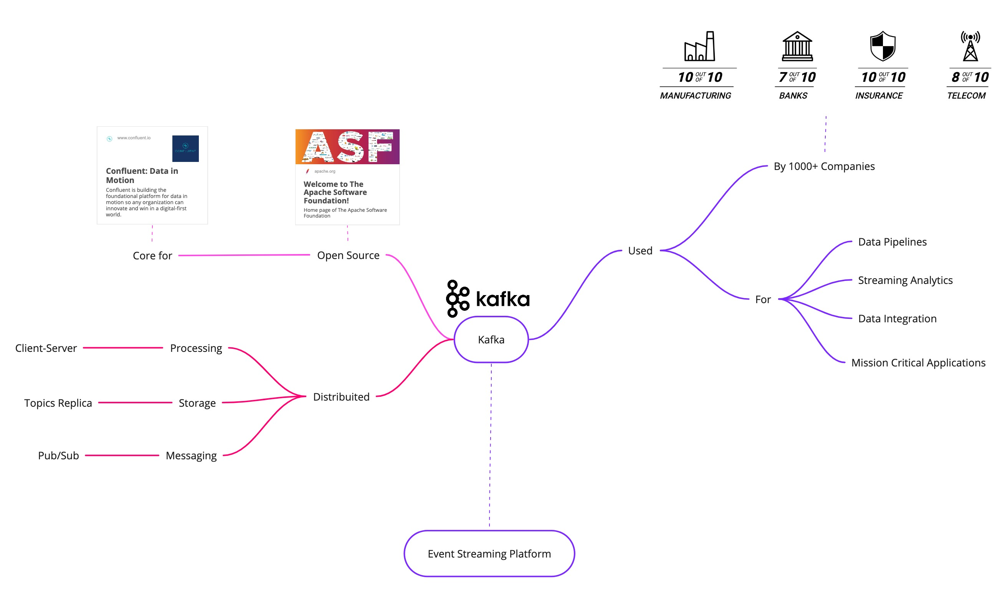
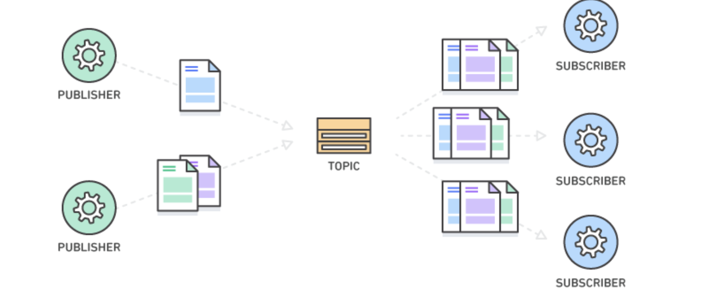
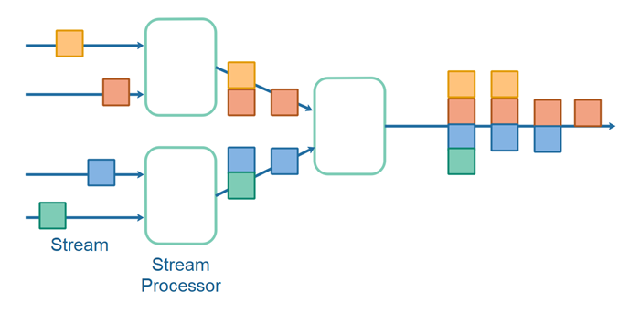
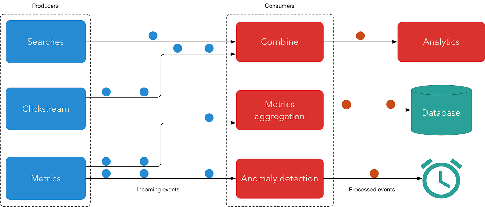
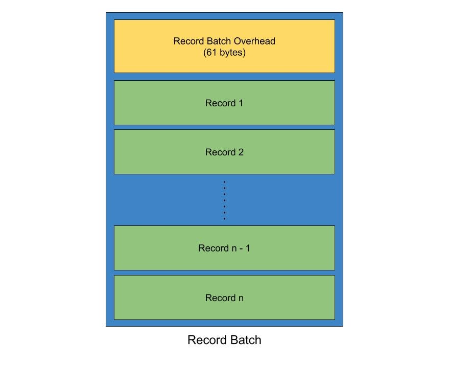
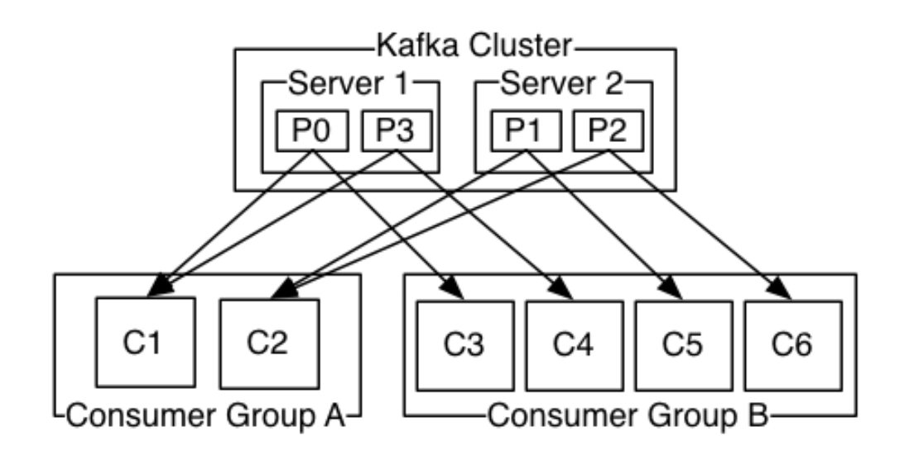

# Apache Kafka

**Apache Kafka** è una piattaforma **open source** per lo **streaming distribuito di eventi**, ampiamente utilizzata in ambito industriale e accademico per la realizzazione di **pipeline di dati ad alte prestazioni**, **analisi in tempo reale**, **integrazione tra sistemi eterogenei** e **applicazioni mission-critical**.

Kafka consente di **acquisire**, **memorizzare**, **elaborare** e **distribuire** flussi continui di dati in tempo reale, fornendo un’infrastruttura **scalabile**, **resiliente** e **ad alta affidabilità**.



---

## Cos’è lo streaming di eventi

Lo **streaming di eventi** può essere considerato l’equivalente digitale del **sistema nervoso centrale** di un’organizzazione moderna.
Rappresenta il fondamento tecnologico di un mondo **sempre connesso**, in cui le imprese sono sempre più **software-defined**, **automatizzate** e **data-driven**, e in cui gli utenti interagiscono costantemente con sistemi intelligenti e integrati.

In termini pratici, lo streaming di eventi consiste nel **raccogliere**, **memorizzare**, **elaborare** e **distribuire** flussi di dati in modo continuo e in tempo reale, consentendo reazioni immediate ai cambiamenti del contesto informativo.

---

## Fasi fondamentali dello streaming di eventi

### 1. Acquisizione dei dati

L’acquisizione consiste nella **raccolta di dati in tempo reale** provenienti da numerose fonti di eventi, quali:

- **Basi di dati** operative o analitiche
- **Sensori** e dispositivi IoT
- **Applicazioni mobili** e web
- **Servizi cloud** e piattaforme SaaS
- **Sistemi software** aziendali o industriali

Ogni evento rappresenta la registrazione di un fatto avvenuto nel sistema, come ad esempio:

> “Un utente ha effettuato un acquisto” oppure “Un sensore ha registrato una temperatura di 27°C”.

---

### 2. Archiviazione dei dati

I flussi di eventi vengono **memorizzati in modo durevole e ordinato** per consentirne il recupero e l’analisi successiva.
Kafka mantiene tali eventi all’interno di **log immutabili** suddivisi in **topic**, strutture che garantiscono **integrità** e **tracciabilità temporale**.

Un interrogativo ricorrente riguarda la possibilità di impiegare Kafka anche come **sistema di archiviazione affidabile**.La risposta è **affermativa**: Kafka è stato progettato per poter conservare i dati anche nel lungo periodo, attraverso due principali meccanismi:

- **Retention policy** configurata su *forever*, che impedisce l’eliminazione automatica dei messaggi.
- **Log compaction**, che conserva soltanto la versione più recente di ogni chiave, mantenendo lo stato aggiornato del sistema.

Tale approccio non è affatto insolito: molte organizzazioni utilizzano Kafka come **archivio primario di eventi**, beneficiando della sua **durabilità** e della capacità di **ri-elaborare i dati storici**.


---

### 3. Elaborazione dei dati

Una volta archiviati, i dati possono essere **elaborati e trasformati** in tempo reale o retrospettivamente, al fine di estrarre informazioni utili o generare nuovi flussi di eventi.Kafka mette a disposizione strumenti specifici per tali operazioni:

- **Kafka Streams** — una libreria Java/Scala per la creazione di applicazioni di elaborazione di flussi direttamente integrate con Kafka.
- **ksqlDB** — un motore SQL che consente di eseguire query in tempo reale sui flussi di eventi, utilizzando un linguaggio dichiarativo simile a SQL.

Attraverso questi strumenti è possibile realizzare:

- Aggregazioni e join su flussi di eventi differenti
- Calcoli su finestre temporali (*windowing*)
- Generazione di nuovi flussi derivati o trasformati

L’elaborazione in streaming consente quindi alle aziende di passare da un approccio **reattivo** a uno **proattivo**, basato su **decisioni informate in tempo reale**.

---

### 4. Instradamento dei dati

L’ultima fase consiste nell’**instradamento** dei flussi di eventi verso i sistemi di destinazione appropriati, che possono comprendere:

- **Data warehouse** o **data lake** per analisi storiche
- **Database transazionali** o **sistemi NoSQL**
- **Servizi cloud** e **microservizi applicativi**
- **Piattaforme di monitoraggio** e **dashboard analitiche**

Kafka agisce così come un **hub di integrazione centrale**, capace di collegare produttori e consumatori di dati, assicurando **bassa latenza**, **scalabilità orizzontale** e **tolleranza ai guasti**.

---

### Elaborazione continua

Lo streaming degli eventi garantisce un **flusso costante e un’interpretazione continua dei dati**, assicurando che le informazioni giuste siano disponibili **nel posto giusto e al momento giusto**.
Questa caratteristica rende Kafka una componente fondamentale nelle architetture **real-time** e nei sistemi **event-driven** moderni.

---

## Kafka come piattaforma di streaming

Kafka, in quanto **piattaforma completa di streaming di eventi**, offre **tre funzionalità chiave** che ne definiscono l’architettura e la versatilità.

---

### 1. Pubblicazione e sottoscrizione dei flussi di record

Kafka consente di **pubblicare e sottoscrivere flussi di record** (eventi), in modo analogo ai tradizionali sistemi di **messaggistica aziendale** o **code di messaggi** (*message queues*).

A differenza di questi ultimi, Kafka è stato progettato per **gestire volumi di dati estremamente elevati**, garantendo **ordine**, **persistenza** e **scalabilità** nel tempo.

I produttori (*producers*) inviano gli eventi ai **topic**, mentre i consumatori (*consumers*) li leggono in tempo reale o in un secondo momento, mantenendo la possibilità di rielaborarli in modo deterministico.



---

### 2. Memorizzazione durevole e a prova di errore dei flussi di record

Kafka è in grado di **memorizzare i flussi di record in modo persistente**, assicurando **resilienza e affidabilità** anche in presenza di guasti di rete, crash di sistema o errori hardware.

La persistenza dei dati è garantita attraverso:

- **Replica dei log** tra più broker del cluster, così che la perdita di un nodo non comporti la perdita di dati.
- **Commit log distribuito**, che assicura l’ordine sequenziale e l’integrità degli eventi.
- **Meccanismi di acknowledgment**, che confermano la corretta ricezione dei messaggi.

Questo modello architetturale consente di trattare Kafka non solo come un sistema di messaggistica, ma anche come un **database distribuito e append-only**, affidabile e scalabile nel tempo.



---

### 3. Elaborazione dei flussi di record in tempo reale

Kafka fornisce una potente capacità di **elaborazione dei flussi di record man mano che si verificano**, permettendo la creazione di applicazioni in grado di **reagire istantaneamente** agli eventi.

Questa funzionalità è resa possibile grazie all’integrazione di **Kafka Streams** e **ksqlDB**, che consentono di:

- Filtrare, trasformare e aggregare i flussi di dati in modo continuo
- Combinare più flussi o unire dati in tempo reale con archivi statici
- Costruire pipeline complesse e reattive basate su log di eventi

L’elaborazione in tempo reale è ciò che distingue Kafka come **piattaforma completa di streaming**, capace non solo di trasmettere dati, ma anche di **attribuire loro significato immediato**.



---

## Applicazioni di Apache Kafka

Kafka viene comunemente impiegato in due principali classi di applicazioni:

1. **Pipeline di dati in streaming**

   - Permettono di trasferire in modo **affidabile e scalabile** i dati tra sistemi o applicazioni eterogenee in tempo reale.
   - *Esempio:* sincronizzazione tra database, acquisizione di log o dati IoT, replicazione tra microservizi.
2. **Applicazioni di streaming in tempo reale**

   - Consentono di **trasformare, analizzare o reagire** ai flussi di dati nel momento stesso in cui vengono generati.
   - *Esempio:* rilevamento di frodi, monitoraggio continuo di sistemi industriali, analisi comportamentale degli utenti.

---

## Concetti fondamentali di Kafka

### Kafka come sistema distribuito

Kafka viene eseguito come **cluster** composto da uno o più server, chiamati **broker**, che possono estendersi su più **data center** o ambienti geografici.
La natura distribuita del sistema garantisce **scalabilità orizzontale**, **alta disponibilità** e **tolleranza ai guasti**.


---

## Organizzazione dei record in Kafka

All’interno di un cluster Kafka, i dati vengono memorizzati e organizzati in **flussi di record** raggruppati in categorie logiche chiamate **topic**.
Ogni topic rappresenta una sequenza ordinata di messaggi (record) che possono essere letti da uno o più consumatori.

### Kafka Records

Ogni **record** in Kafka è costituito da tre elementi principali:

- una **chiave** (*key*)
- un **valore** (*value*)
- un **timestamp**

I messaggi sono composti da:

- un’intestazione di lunghezza variabile
- un array di byte per la **chiave** (facoltativa)
- un array di byte per il **valore**

La scelta di mantenere la chiave e il valore come **byte opachi** consente una maggiore flessibilità: le applicazioni possono adottare il **metodo di serializzazione** più adatto alle proprie esigenze, come **Avro**, **JSON**, **Protobuf** o **String**.

Inoltre, Kafka gestisce i dati in **batch di record**, ovvero insiemi di uno o più messaggi che vengono scritti e trasmessi insieme per migliorare l’efficienza e ridurre l’overhead di rete.
Il termine tecnico per un insieme di messaggi è appunto **batch di record**, e in casi limite può contenere anche un solo elemento.



---

## Intestazione del record di Kafka

Sia i **batch di record** sia i singoli **record** contengono **intestazioni (headers)** che descrivono metadati tecnici fondamentali per la gestione, la compressione e la validazione dei messaggi.

### Campi principali dell’intestazione del batch di record


| Campo                    | Tipo  | Descrizione                                              |
| ------------------------ | ----- | -------------------------------------------------------- |
| **baseOffset**           | int64 | Indice del primo record del batch.                       |
| **batchLength**          | int32 | Lunghezza totale del batch in byte.                      |
| **partitionLeaderEpoch** | int32 | Versione corrente della partizione.                      |
| **magic**                | int8  | Versione del formato del record (valore attuale: 2).     |
| **crc**                  | int32 | Codice di controllo per la verifica dell’integrità.    |
| **attributes**           | int16 | Flag che definiscono compressione e tipologia di batch.  |
| **lastOffsetDelta**      | int32 | Differenza tra l’offset dell’ultimo record e il primo. |
| **firstTimestamp**       | int64 | Timestamp del primo record nel batch.                    |
| **maxTimestamp**         | int64 | Timestamp più recente nel batch.                        |
| **producerId**           | int64 | Identificativo del produttore del batch.                 |

### Attributi di compressione e controllo

Il campo `attributes` specifica diverse proprietà di un batch di record:

- **bit 0–2:** tipo di compressione
  - `0`: nessuna compressione
  - `1`: gzip
  - `2`: snappy
  - `3`: lz4
  - `4`: zstd
- **bit 3:** tipo di timestamp
- **bit 4:** batch transazionale (`0` = non transazionale)
- **bit 5:** batch di controllo (`0` = non di controllo)
- **bit 6–15:** non utilizzati

Questa struttura consente a Kafka di garantire **coerenza, affidabilità e compatibilità retroattiva** dei dati, ottimizzando al contempo **prestazioni e compressione** dei log distribuiti.

---
## API

### Produttore 
Pubblicare (scrivere) un flusso di eventi su uno o più argomenti di Kafka.

```python
from time import sleep
from json import dumps
from kafka import KafkaProducer

# Inizializza il produttore Kafka
producer = KafkaProducer(
    bootstrap_servers=['localhost:9092'],
    value_serializer=lambda x: dumps(x).encode('utf-8')
)

# Invio di 1000 messaggi al topic 'numtest'
for e in range(1000):
    data = {'number': e}
    producer.send('numtest', value=data)
    print(f"Messaggio inviato: {data}")
    sleep(5)
```

### Consumatore
Per iscriversi (leggere) a uno o più argomenti ed elaborare il flusso di eventi ad essi prodotti.
```python

from kafka import KafkaConsumer
from json import loads

consumer = KafkaConsumer(
    'numtest',
     bootstrap_servers=['localhost:9092'],
     auto_offset_reset='earliest',
     enable_auto_commit=True,
     group_id='my-group',
     value_deserializer=lambda x: loads(x.decode('utf-8')))

for message in consumer:
    message = message.value
    print('{} read'.format(message))
```
### Flussi
Consente a un'applicazione di agire come un **processore di flusso**, consumando un flusso di input da uno o più argomenti e producendo un flusso di output per uno o più argomenti di output, trasformando efficacemente i flussi di input in flussi di output.

---

### Connettore
Consente di **creare ed eseguire produttori o consumatori riutilizzabili** che collegano argomenti Kafka ad applicazioni o sistemi di dati esistenti.  
Ad esempio, un connettore a un **database relazionale** potrebbe catturare ogni modifica apportata a una tabella e pubblicarla in tempo reale su un topic Kafka.

---

### Comunicazione
In Kafka, la **comunicazione tra client e server** avviene tramite un **protocollo TCP** semplice, ad alte prestazioni e indipendente dal linguaggio.

#### Protocollo di Kafka
Questo protocollo è **versionato** e mantiene la **compatibilità retroattiva** con le versioni precedenti.  
Viene fornito un **client Java ufficiale**, ma esistono implementazioni in numerosi altri linguaggi (Python, Go, C/C++, Node.js, ecc.).

---

### Argomento
Un **argomento** (*topic*) è il nome di una **categoria o feed** in cui vengono pubblicati i record.  
Gli argomenti in Kafka sono sempre **multi-subscriber**, ovvero un argomento può avere **zero, uno o più consumatori** che si abbonano ai dati in esso scritti.

---

### Partizione
Ogni **partizione** è una **sequenza ordinata e immutabile di record** che viene continuamente aggiunta a un **log di commit strutturato**.  
A ciascun record nelle partizioni viene assegnato un numero identificativo sequenziale, chiamato **offset**, che lo identifica in modo univoco all’interno della partizione.

---

### Conservazione
Il **cluster Kafka** conserva in modo permanente tutti i record pubblicati, indipendentemente dal fatto che siano stati utilizzati o meno, utilizzando un **periodo di conservazione configurabile**.  
Ad esempio, se la *retention policy* è impostata su **due giorni**, un record sarà disponibile per l’utilizzo per i due giorni successivi alla pubblicazione, dopodiché verrà eliminato per liberare spazio.  
Le prestazioni di Kafka restano **costanti rispetto alla dimensione dei dati**, quindi l’archiviazione prolungata non rappresenta un problema.

---

## Produttore vs Consumatore

### Produttore
I **produttori** pubblicano i dati sugli argomenti da loro scelti.  
Sono responsabili della **scelta della partizione** a cui assegnare ciascun record, che può avvenire:

- in modalità **round-robin** per bilanciare uniformemente il carico;  
- oppure tramite una **funzione di partizionamento semantica**, ad esempio basata su una chiave specifica del record.

---

### Consumatore
I **consumatori** si identificano tramite un **nome di gruppo**.  
Ogni record pubblicato su un argomento viene consegnato a **una sola istanza di consumatore** all’interno di ciascun gruppo di consumatori abbonato.  
Le istanze di consumatore possono essere in processi o macchine diversi, permettendo un’elaborazione **distribuita e parallela**.

---

## Stesso gruppo o no?

- Se tutte le istanze del consumatore appartengono **allo stesso gruppo**, il carico dei record viene **bilanciato** tra le istanze.  
- Se invece le istanze appartengono a **gruppi diversi**, ogni record viene **trasmesso a tutti** i consumatori, duplicando l’elaborazione.

---

### Esempio
Un cluster Kafka con **due server** che ospitano **quattro partizioni** (P0–P3) e **due gruppi di consumatori**:  
il gruppo **A** con due istanze di consumatori e il gruppo **B** con quattro.



## Garanzie

Kafka fornisce forti **garanzie di ordinamento e durabilità** per i messaggi pubblicati:

- I messaggi inviati da un **produttore** a una determinata **partizione** vengono aggiunti **nell’ordine in cui sono inviati**.  
  In altre parole, se un record *M1* viene inviato prima di *M2* dallo stesso produttore, allora *M1* avrà un **offset inferiore** e **apparirà prima nel log**.

- Ogni **istanza di consumatore** legge i record **nell’ordine in cui sono archiviati** nel log della partizione.

- Per un argomento con **fattore di replicazione N**, Kafka può **tollerare fino a N−1 guasti** di server **senza perdere alcun record** già inserito nel log.

---

### Kafka come sistema di messaggistica

Tradizionalmente, i sistemi di messaggistica si basano su due modelli fondamentali:

1. **Coda (Queue)**  
   Un gruppo di consumatori legge i messaggi da un server e ogni record viene consegnato **a un solo consumatore**.  

2. **Pub/Sub (Publish–Subscribe)**  
   Ogni record viene **trasmesso a tutti i consumatori** iscritti.

---

Kafka **generalizza entrambi i modelli** attraverso il concetto di **gruppo di consumatori** (*consumer group*):  

- Come in una **coda**, il gruppo di consumatori consente di **suddividere l’elaborazione** dei record tra più processi appartenenti allo stesso gruppo.  
- Come nella **pubblicazione–sottoscrizione**, Kafka consente di **trasmettere gli stessi messaggi a più gruppi di consumatori** indipendenti.  

---

Grazie al **parallelismo basato sulle partizioni**, Kafka offre contemporaneamente:

- **Garanzie di ordinamento**: all’interno di ciascuna partizione, i messaggi vengono sempre letti nell’ordine in cui sono stati prodotti.  
- **Bilanciamento del carico**: le partizioni di un topic vengono distribuite tra i consumatori del gruppo, garantendo che **ogni partizione sia elaborata da un solo consumatore** per volta.

In questo modo, ogni **consumer** è l’unico lettore della propria partizione, mantenendo l’ordine dei dati.  
Poiché esistono **più partizioni**, il carico di lavoro risulta comunque distribuito tra le diverse istanze del consumatore.

> **Nota Bene:** non possono esserci più istanze di consumatori in un gruppo di consumatori rispetto al numero di partizioni di un argomento.

## Kafka come sistema di archiviazione

Kafka non è soltanto una piattaforma di messaggistica, ma anche un **sistema di archiviazione distribuito** ad alte prestazioni.

- Qualsiasi **coda di messaggi** che consente la **pubblicazione disaccoppiata dal consumo** agisce di fatto come un sistema di archiviazione temporanea per i messaggi in transito.

- I **dati scritti su Kafka** vengono **persistiti su disco** e **replicati** tra più broker per garantire **tolleranza ai guasti** e **durabilità**.  
  Kafka consente ai **produttori** di attendere **acknowledgment** di ricezione: una scrittura è considerata completata solo quando è **completamente replicata**, assicurando che i dati rimangano disponibili anche in caso di errore del nodo su cui sono stati originariamente scritti.

- Prendendo sul serio il concetto di **archiviazione persistente** e permettendo ai **client** di controllare la propria **posizione di lettura (offset)**, Kafka può essere visto come una sorta di **file system distribuito specializzato**.  
  È progettato per l’**archiviazione**, la **replicazione** e la **propagazione** di log di commit con **alte prestazioni** e **bassa latenza**.

### Kafka come elaborazione di flussi

Kafka non si limita a **leggere**, **scrivere** e **memorizzare** flussi di dati:  
il suo vero obiettivo è **abilitare l’elaborazione in tempo reale** dei flussi.

In Kafka, un **processore di flusso** è qualsiasi entità — applicazione o componente — che:

1. **Riceve flussi continui di dati** da uno o più **argomenti di input** (*input topics*);  
2. **Esegue elaborazioni** o trasformazioni su tali dati (filtraggio, aggregazione, join, analisi in finestra temporale, ecc.);  
3. **Produce flussi di output** verso uno o più **argomenti di output** (*output topics*).

In altre parole, Kafka fornisce gli strumenti per costruire applicazioni **reattive e continue**, che reagiscono ai dati non appena vengono generati.

> Esempio:  
> un’applicazione di **vendita al dettaglio** può acquisire flussi di input relativi a **vendite** e **spedizioni**,  
> ed elaborare in tempo reale un flusso di **riordini automatici** e **adeguamenti dinamici dei prezzi** basati sui dati ricevuti.

## Un'API dedicata

Kafka consente di eseguire **elaborazioni semplici** direttamente tramite le API del **produttore** e del **consumatore**.  
Tuttavia, per **trasformazioni più complesse**, fornisce un’API completamente integrata: la **Kafka Streams API**.

Questa API consente di costruire applicazioni capaci di:

- Effettuare **aggregazioni** sui flussi di dati;
- **Unire (join)** flussi provenienti da sorgenti differenti;
- Eseguire **trasformazioni stateful**, mantenendo informazioni tra eventi successivi.

La Kafka Streams API affronta e risolve alcune delle sfide più comuni delle applicazioni di streaming, come:

- **Gestione dei dati fuori ordine**;
- **Rielaborazione dell’input** in seguito a modifiche del codice;
- **Calcoli con stato persistente**;
- **Tolleranza ai guasti** attraverso il meccanismo dei gruppi di processori.

Internamente, la Streams API si basa sulle primitive principali di Kafka:

- utilizza le API di **Producer** e **Consumer** per la gestione dei flussi in ingresso e in uscita;
- sfrutta Kafka stesso come **archivio di stato** distribuito e replicato;
- utilizza il **meccanismo dei gruppi di consumatori** per garantire **scalabilità e fault tolerance** tra le istanze dell’applicazione di streaming.

In questo modo, la Kafka Streams API fornisce un’infrastruttura completa per lo **stream processing nativo**, integrata direttamente nella piattaforma Kafka.

---

## Mettere insieme i pezzi

La combinazione di **messaggistica**, **archiviazione** ed **elaborazione di flussi** può sembrare insolita, ma rappresenta la chiave del ruolo di Kafka come **piattaforma di streaming unificata**.

Per comprendere questa integrazione, è utile un confronto con altri sistemi:

- Un **file system distribuito**, come **HDFS**, permette di archiviare file statici per l’**elaborazione batch**, consentendo di analizzare dati **storici**.
- Un **sistema di messaggistica tradizionale** consente di elaborare soltanto i **messaggi futuri**, ovvero quelli che arrivano dopo l’iscrizione del consumatore.

Kafka, invece, **unisce entrambi i paradigmi**:

- consente di **archiviare e rielaborare** dati passati (*historical data*);  
- permette di **elaborare in tempo reale** i dati che continuano ad arrivare (*streaming data*).

Questa duplice natura è ciò che rende Kafka una piattaforma **ibrida e completa**, ideale sia per:

- **applicazioni di streaming** in tempo reale;  
- sia per la costruzione di **pipeline di dati** affidabili e scalabili.

Kafka, quindi, funge da **ponte tra passato e futuro dei dati**, abilitando un flusso continuo e coerente tra acquisizione, archiviazione ed elaborazione.

## Passato e futuro

Combinando **archiviazione persistente** e **abbonamenti a bassa latenza**, Kafka consente alle applicazioni di streaming di trattare in modo uniforme **i dati passati e quelli futuri**.

In questo modello unificato:

- un’applicazione può **elaborare dati storici e archiviati**, partendo dal primo record disponibile;
- ma, invece di terminare l’elaborazione una volta raggiunto l’ultimo record, può **continuare a processare i nuovi dati** che arrivano in tempo reale.

Questa capacità estende il concetto tradizionale di elaborazione di flussi, integrando in un’unica architettura:

- l’**elaborazione batch**, tipica dei sistemi orientati ai dati storici;  
- e le **applicazioni event-driven**, tipiche dei sistemi di messaggistica in tempo reale.

Kafka unifica così il passato e il futuro dei dati, permettendo di analizzare e reagire **continuamente** al loro evolversi.

---

## Pipeline di dati a bassa latenza

Per le **pipeline di dati in streaming**, Kafka offre un equilibrio unico tra **latenza minima** e **affidabilità elevata**.

- La **sottoscrizione in tempo reale** agli eventi consente di creare pipeline a **bassa latenza**, ideali per flussi di dati continui e aggiornamenti immediati.
- La capacità di **memorizzare i dati in modo durevole** rende Kafka adatto anche per scenari **critici**, in cui la consegna deve essere **garantita** o in cui l’integrazione con sistemi **offline** richiede robustezza e tolleranza ai guasti.

Inoltre, le funzionalità di **stream processing** permettono di:

- **trasformare i dati** man mano che arrivano;  
- **arricchirli o filtrarl**i in tempo reale;  
- e instradarli verso diversi sistemi di destinazione.

Grazie a queste caratteristiche, Kafka è oggi la tecnologia di riferimento per la costruzione di **pipeline di dati distribuite**, **affidabili** e **scalabili**, capaci di supportare tanto l’analisi immediata quanto l’elaborazione differita.
