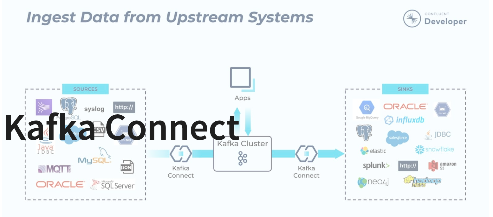
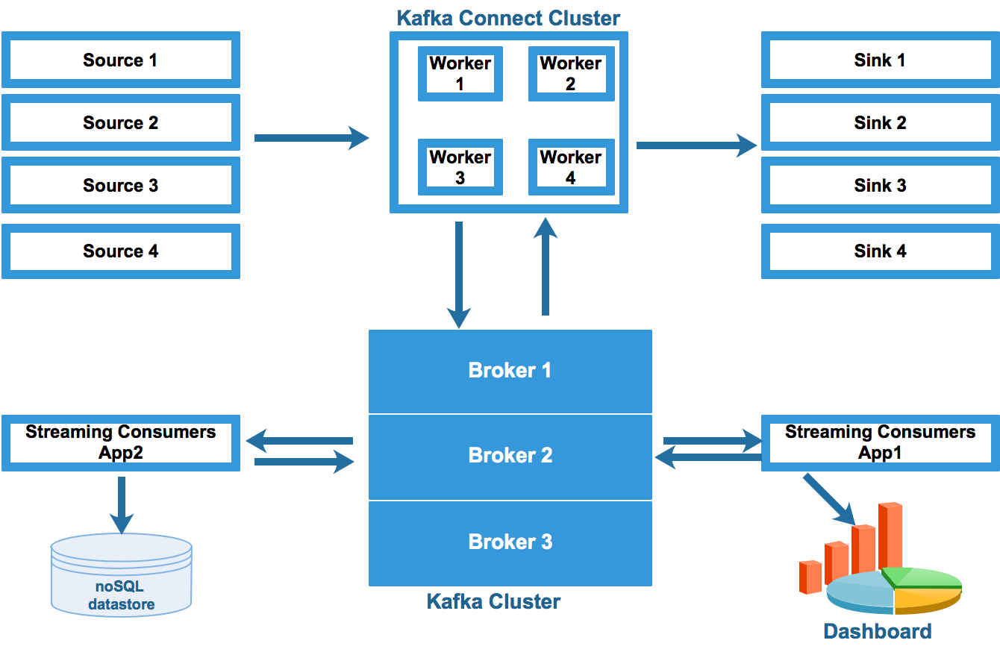

# Kafka Connect  


## Panoramica

**Kafka Connect** è uno strumento progettato per realizzare pipeline di streaming dei dati in modo scalabile, affidabile e facilmente estendibile tra **Apache Kafka** e sistemi esterni.  
Consente di acquisire interi database, raccogliere log o metriche da applicazioni e trasferirli in tempo reale verso i topic Kafka, rendendo tali informazioni immediatamente disponibili per l’elaborazione a bassa latenza.  
Allo stesso modo permette di esportare i dati da Kafka verso sistemi di archiviazione, database analitici o piattaforme batch, integrando in maniera efficiente flussi *streaming* e processi *offline*.

---

## Caratteristiche

### ✔ Framework comune per i connettori Kafka
Kafka Connect fornisce un **framework standardizzato** che facilita l’integrazione di sistemi di dati esterni con Kafka.  
Ciò semplifica lo sviluppo, la distribuzione e la gestione sia dei connettori *source* che *sink*.

### ✔ Modalità standalone e distribuita
Kafka Connect può essere eseguito in due modalità operative:

- **Standalone**: indicata per test, sviluppo, o piccole installazioni.  
- **Distributed**: progettata per ambienti produttivi, consente gestione centralizzata, ridondanza e bilanciamento automatico del carico tramite più worker.

### ✔ Gestione automatica degli offset
Kafka Connect gestisce automaticamente gli **offset**, evitando agli sviluppatori la necessità di implementare manualmente la logica di commit.

**Esempio — File Source Connector**

- tiene traccia dell’ultimo byte letto da un file salvandolo come offset;  
- aggiorna periodicamente tale posizione;  
- in caso di riavvio, riprende dall’ultima posizione salvata;  
- evita riletture complete e duplicazione dei messaggi nei topic Kafka.

---

## Distribuito e scalabile per impostazione predefinita  
Kafka Connect sfrutta il protocollo di **group management** nativo di Kafka.  
È possibile scalare linearmente aggiungendo nuovi worker al cluster, migliorando capacità e affidabilità.



---

## Integrazione streaming/batch
Sfruttando l’architettura di Kafka, Kafka Connect rappresenta una soluzione ideale per collegare sistemi di dati **in streaming** e **batch**.  
Permette di:

- acquisire dati in tempo reale,
- conservarli in Kafka per analisi successive,
- alimentarli a job periodici, motori ETL o database analitici.

In questo modo funge da ponte affidabile tra processi continui e processi a esecuzione differita.

---
### Esempio: Connect Standalone Demo

#### Avvio di un worker Kafka Connect

Un worker può essere avviato tramite il seguente comando:

> `bin/connect-standalone.sh config/connect-standalone.properties [connector1.properties connector2.properties ...]`

---

## File to File

**Obiettivo:** creare un processo Kafka Connect che **legge da un file** e **scrive su un altro file**, utilizzando un connettore *source* (file → topic Kafka) e un connettore *sink* (topic Kafka → file).

### Proprietà del worker
```properties
bootstrap.servers=kafkaServer:9092

key.converter=org.apache.kafka.connect.json.JsonConverter
value.converter=org.apache.kafka.connect.json.JsonConverter

key.converter.schemas.enable=true
value.converter.schemas.enable=true

offset.storage.file.filename=/tmp/connect.offsets
offset.flush.interval.ms=10000

plugin.path=/opt/kafka/libs/connect-file-3.8.0.jar
```

### Proprietà del sorgente
``` properties
name=local-file-source
connector.class=FileStreamSource
tasks.max=1
file=test.txt
topic=connect-test
```
### Proprietà del sink
``` properties
name=local-file-sink
connector.class=FileStreamSink
tasks.max=1
file=test.sink.txt
topics=connect-test
```
### Esegui la demo
``` properties
# GO in repo/kafka-connect dir
cd kafka-connect

# Start Kafka Server
docker run --rm -p 9092:9092 --network tap --name kafkaServer -v $(pwd):/connect apache/kafka:4.1.0

# Create the topic (optional)
docker exec -it --workdir /opt/kafka/bin/ kafkaServer ./kafka-topics.sh --create --bootstrap-server kafkaServer:9092  --topic connect-test --partitions 1

# Start connect 
docker exec -it --workdir /opt/kafka/bin/ kafkaServer ./connect-standalone.sh /connect/connect-standalone.properties /connect/connect-file-source.properties /connect/connect-file-sink.properties

# In another tab write to the source file
docker exec -it kafkaServer sh -c "echo hello > /tmp/my-test.txt"

# In another tab open a consumer
docker exec --workdir /opt/kafka/bin/ -it kafkaServer ./kafka-console-consumer.sh --topic connect-test --from-beginning --bootstrap-server localhost:9092

# In another tab run a tail on the destination  
docker exec -it kafkaServer sh -c "tail -f /tmp/test.sink.txt"
```
### API REST
``` properties
# Open a new tab 
docker exec -it kafkaServer wget -qO /tmp/api  http://localhost:8083/connectors
docker exec -it kafkaServer cat /tmp/api  
``` 