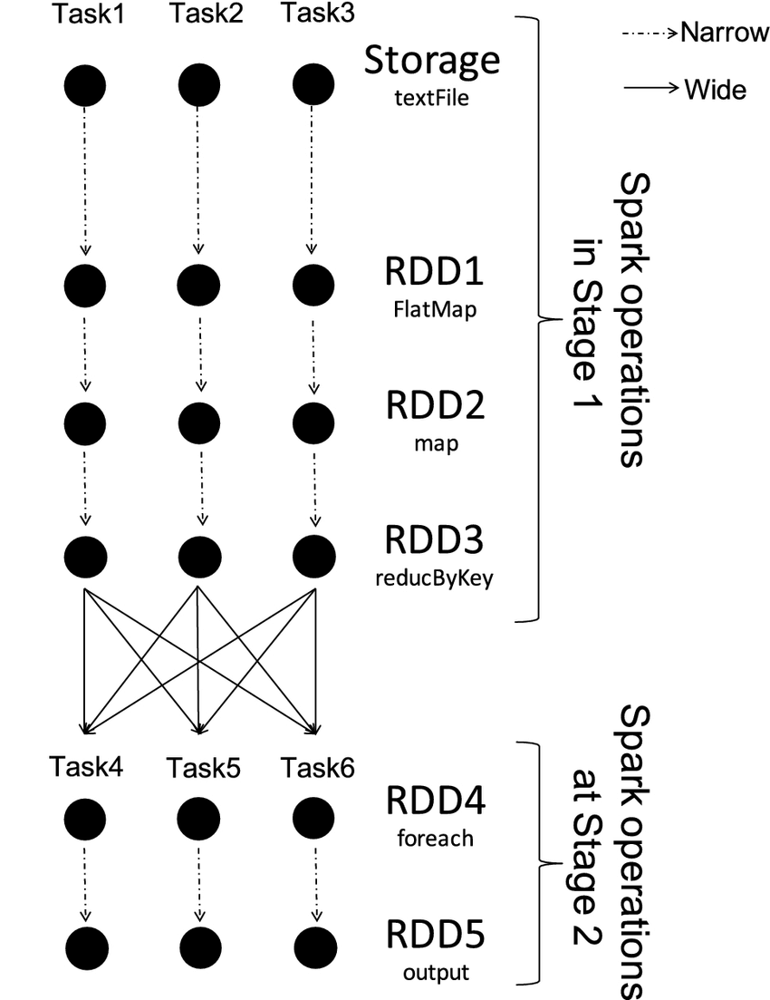
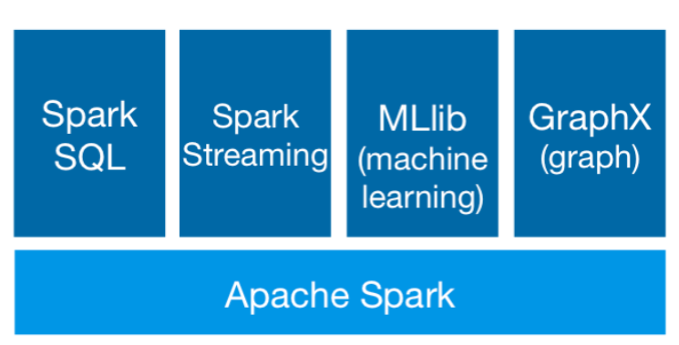
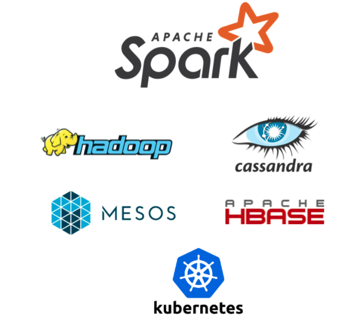

# Apache Spark

Apache Spark è un motore unificato per l’analisi dei dati su larga scala. Supporta diversi linguaggi di programmazione e consente l’esecuzione di carichi di lavoro di data engineering, data science e machine learning sia su macchine a nodo singolo sia su cluster distribuiti.

## Sistema distribuito

Spark è un framework avanzato per l’elaborazione distribuita, progettato per eseguire codice in parallelo su molteplici nodi. La piattaforma gestisce automaticamente la distribuzione dei dati, la pianificazione delle attività e il recupero dagli errori, offrendo un modello di programmazione semplice, efficiente e orientato alla scalabilità.

## Filosofia di Spark

La progettazione di Spark si fonda su quattro principi cardine: **velocità**, **facilità d’uso**, **modularità** ed **estensibilità**, elementi che hanno contribuito alla sua affermazione come tecnologia di riferimento nel panorama Big Data.

### Velocità

Spark può eseguire carichi di lavoro fino a cento volte più rapidamente rispetto ai sistemi tradizionali basati su Hadoop MapReduce. Tale risultato è reso possibile grazie all’elaborazione in memoria, a uno scheduler DAG (*Directed Acyclic Graph*) estremamente efficiente, a un motore di esecuzione fisica avanzato e a un ottimizzatore di query evoluto.

L’efficienza complessiva è favorita anche dai moderni server: economici, dotati di ampia memoria, processori multicore e sistemi operativi ottimizzati per il multithreading. Il modello DAG consente inoltre di scomporre un programma in attività indipendenti, eseguibili simultaneamente sui nodi del cluster.

  


### Facilità d’uso

Un aspetto fondamentale del successo di Spark è la sua elevata usabilità. Le API unificate sono disponibili in Python, Scala, Java e R, con la possibilità di operare tramite shell interattive come PySpark e la REPL Scala, utili per esplorazione, prototipazione e debug.

L’uso di strutture dati familiari — DataFrame e SQL — semplifica la manipolazione dei dati e riduce la complessità dei flussi di lavoro. Il meccanismo di *lazy evaluation* permette di ottimizzare automaticamente le pipeline, mentre l’elaborazione in memoria accelera i processi iterativi tipici del machine learning e dell’analisi esplorativa.

Le librerie integrate, tra cui Spark Streaming, MLlib e GraphX, completano l’ecosistema fornendo strumenti avanzati per applicazioni reali.

### Modularità

Spark consente lo sviluppo rapido di applicazioni in Java, Scala, Python, R e SQL, mettendo a disposizione oltre ottanta operatori di alto livello che semplificano la programmazione parallela. L’ambiente supporta anche l’uso interattivo, facilitando prototipazione e debugging.

Esempio minimo in PySpark:

```python
df = spark.read.json("logs.json")
df.where("age > 21").select("name.first").show()
```

## Generalità

Spark alimenta un ricco insieme di librerie e componenti:

- **Spark SQL** per la gestione di dati strutturati.
- **Spark Streaming** per la creazione di pipeline e applicazioni streaming.
- **MLlib**, libreria di machine learning scalabile.
- **GraphX** per l’elaborazione parallela di grafi.
- **API Pandas on Spark**, che permette di utilizzare la sintassi Pandas su Spark.
- **Spark Connect**, un’interfaccia client–server per connettersi a un cluster Spark remoto.



Spark può essere eseguito in molteplici modalità: su Hadoop, Apache Mesos, Kubernetes, in modalità standalone o in ambienti cloud. È possibile utilizzarlo in cluster standalone, su EC2, YARN, Mesos o Kubernetes.



### Accesso a diverse fonti di dati esterne

**Analyse**  
Spark può creare dataset distribuiti da qualsiasi fonte supportata da Hadoop, tra cui file system locale, HDFS, Cassandra, HBase, Amazon S3 e molte altre. Supporta file di testo, SequenceFile e qualsiasi formato compatibile con Hadoop InputFormat.

**Query**  
Spark SQL consente di interagire con diverse sorgenti dati tramite DataFrame. Un DataFrame può essere trasformato tramite operazioni relazionali e registrato come vista temporanea, sulla quale è possibile eseguire query SQL.

## Riassumendo

- **Apache Spark** è un sistema di calcolo distribuito rapido e generico, progettato per l’esecuzione di applicazioni su cluster.

- Offre API di alto livello in Java, Scala, Python e R, insieme a un motore ottimizzato che supporta grafi di esecuzione generali.

- Supporta un ricco insieme di strumenti avanzati, tra cui Spark SQL per l’elaborazione di dati strutturati, MLlib per il machine learning, GraphX per il calcolo su grafi e Spark Streaming per l’elaborazione di flussi di dati.
## Dati batch e streaming

Spark permette di unificare l’elaborazione **batch** e **streaming in tempo reale** utilizzando il linguaggio preferito (Python, SQL, Scala, Java o R). Questo consente di progettare pipeline eterogenee basate su un’unica API coerente, riducendo la complessità di integrazione tra sistemi diversi.

## Analisi SQL

Spark consente di eseguire query SQL ANSI distribuite e ad alte prestazioni, idonee sia al dashboarding sia al reporting ad hoc. Il motore SQL di Spark risulta spesso più rapido rispetto a molti data warehouse tradizionali.

## Scienza dei dati su larga scala

Spark permette di eseguire analisi esplorative dei dati (EDA) su dataset di dimensioni fino alla scala dei petabyte, evitando la necessità di downsampling o riduzioni preliminari del volume informativo. Le operazioni possono essere eseguite in modo interattivo grazie all’elaborazione distribuita in memoria.

## Apprendimento automatico

MLlib consente di addestrare algoritmi di apprendimento automatico su un laptop e, senza modificare il codice, di scalare il training su cluster _fault-tolerant_ composti da centinaia o migliaia di nodi. Questa caratteristica rende Spark ideale per pipeline di machine learning industriali e progetti di ricerca su larga scala.
### Esecuzione di un esempio di base di Spark in Docker

#### SparkPi
```bash
docker run -it --rm apache/spark /opt/spark/bin/run-example SparkPi 10
```

#### Spark Shell
https://spark.apache.org/docs/latest/quick-start.html#interactive-analysis-with-the-spark-shell

## Eseguire una shell Scala Spark in Docker
```bash
docker run --hostname spark -p 4040:4040 -it --rm   -e HOME=/opt/spark/work-dir   -v "$(pwd)/spark/dataset:/tmp/dataset"   apache/spark /opt/spark/bin/spark-shell   --conf "spark.driver.extraJavaOptions=-Duser.home=/opt/spark/work-dir"
```

### Spark shell in azione
```spark
WARNING: Using incubator modules: jdk.incubator.vector
Using Spark's default log4j profile: org/apache/spark/log4j2-defaults.properties
Setting default log level to "WARN".
To adjust logging level use sc.setLogLevel(newLevel). For SparkR, use setLogLevel(newLevel).
Welcome to
      ____              __
     / __/__  ___ _____/ /__
    _\ \/ _ \/ _ `/ __/  '_/
   /___/ .__/\_,_/_/ /_/\_\   version 4.0.1
      /_/

Using Scala version 2.13.16 (OpenJDK 64-Bit Server VM, Java 21.0.8)
Type in expressions to have them evaluated.
Type :help for more information.
25/11/02 10:29:57 WARN NativeCodeLoader: Unable to load native-hadoop library for your platform... using builtin-java classes where applicable
Spark context Web UI available at http://spark:4040
Spark context available as 'sc' (master = local[*], app id = local-1762079398241).
Spark session available as 'spark'.

scala>
```

### Esempio
```scala
val textFile = spark.read.textFile("file:///tmp/dataset/lotr_characters.csv")
textFile
textFile.count()
textFile.first()
```
### Avviare PySpark con Docker
```bash
docker run --hostname spark -p 4040:4040 -it --rm -v ./spark/dataset:/tmp/dataset  apache/spark /opt/spark/bin/pyspark
```
### Creare un RDD da un elenco Python
``` python
# Create a list
data = range(10000) 
# Create a RDD using parallelize. 
distData = sc.parallelize(data) 
# who is sc ?
sc
# and distData ?
distData
# Let's list
distData.collect()
```
### Creare un RDD da un file di testo
```python
# An RDD can be also created from external storage
# textFile creates a RDD(String) (remember when we use spark.read.file)
distFile = sc.textFile("/tmp/dataset/The Return Of The King_djvu.txt") 
distFile

# Take the first ones
distFile.take(10)
```
### Funzione di riduzione della mappa 
```python
sizeOfBook=distFile.map(lambda s: len(s)).reduce(lambda a, b: a + b)
sizeOfBook

# Let's do in steps

# First step for each line compute the lenght of the line 
mappa = distFile.map(lambda s: len(s))
# Show some elements
mappa.take(20)
# Then sum all the elements of the RDD 
reduce=mappa.reduce(lambda a, b: a + b)
reduce
```
## Coppie chiave valore 
In Spark le operazioni possono essere applicate a RDD contenenti oggetti di qualunque tipo. Tuttavia, alcune trasformazioni sono disponibili **solo** per gli RDD costituiti da _coppie chiave-valore_ (ad esempio `(K, V)`). Questo perché molte operazioni fondamentali — come il raggruppamento, l’aggregazione e altre forme di _shuffle distribuito_ — richiedono la presenza di una chiave sulla quale partizionare e organizzare gli elementi.

Le operazioni come **`groupByKey`**, **`reduceByKey`**, **`aggregateByKey`** o **`join`** funzionano infatti solo quando gli elementi sono rappresentati come tuple `(key, value)`. In Spark la procedura tipica consiste nel **creare un RDD di coppie chiave-valore** e in seguito applicare l’operazione desiderata.
### Esempio: Conteggio delle parole 
```python
# Create a RDD of pairs from file, 
pairs = distFile.map(lambda s: (s, 1))
pairs
# We have create a new RDD, let's see what it contains
pairs.take(50)
# Now we can use a reduce function, to count how may times the line appears in the document
counts = pairs.reduceByKey(lambda a, b: a + b)
counts.take(50)
# Let's order by key
ordered=counts.sortByKey()
# and take ordered
ordered.takeOrdered(10)
```
### Esempio: Parola piu frequente
```python
words=distFile.flatMap(lambda line:line.split(" "))
words.take(100)
# Great, let's assign a counter and then sum
wordCounters=words.map(lambda word: (word, 1)).reduceByKey(lambda a, b: a + b)
wordCounters.take(10)
# Ok I want to sort now
wordsSorted=wordCounters.takeOrdered(200, key = lambda x: -x[1])
wordsSorted
```
